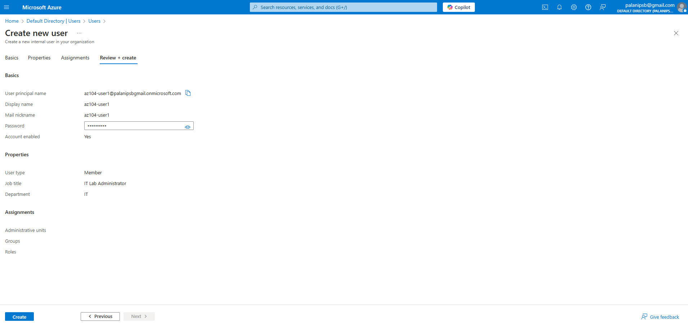
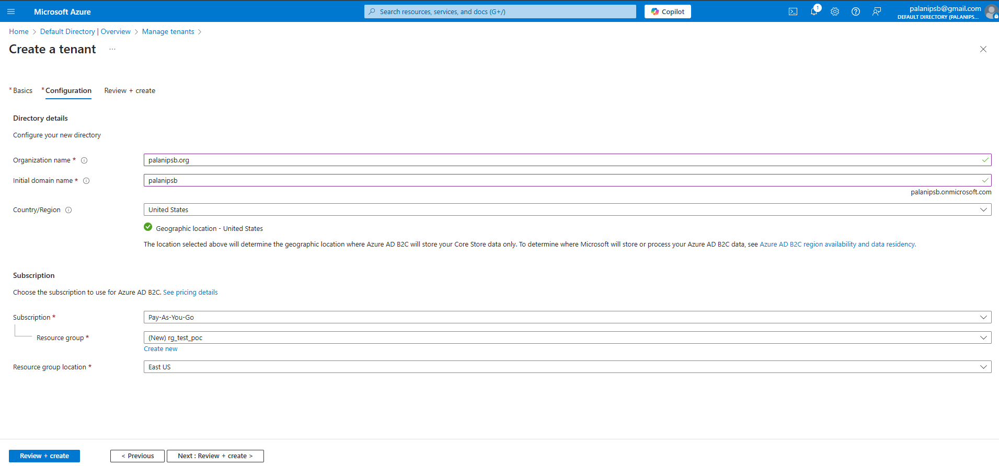
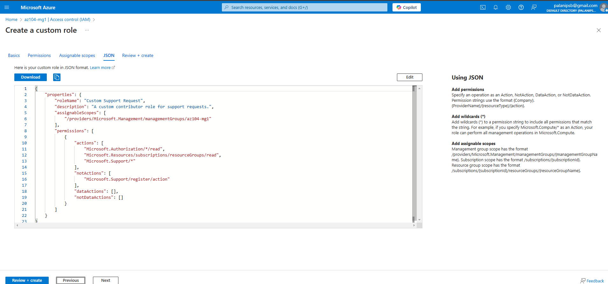

# Manage Subscriptions and RBAC

## Lab 01 - Manage Microsoft Entra ID Identities

### Task 1: Create and configure user accounts.

### Task 2: Create groups and add members.

## Lab 02a - Manage Subscriptions and RBAC

### Task 1: Implement management groups.

### Task 2: Review and assign a built-in Azure role.

### Task 3: Create a custom RBAC role.

